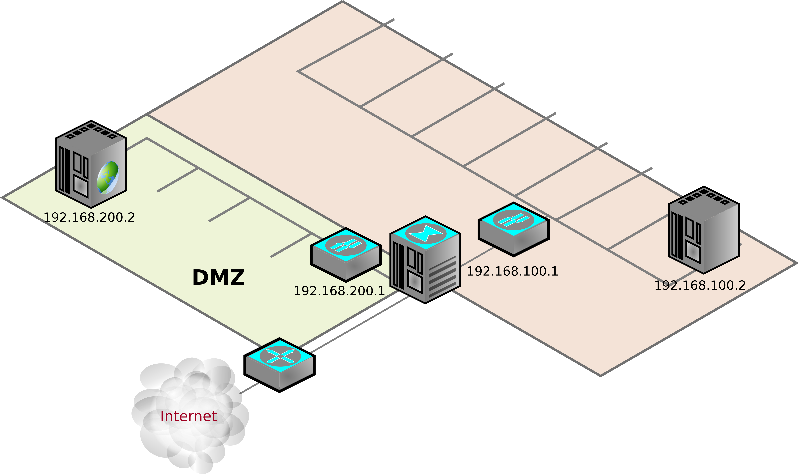

# Cortafuegos perimetral con iptables

Vamos a realizar los primeros pasos para implementar un cortafuegos
que protege la red interna y da acceso a los servicios de la DMZ,
aunque hay algunas cosas que requieren la definición de reglas de NAT
que se verá en la siguiente sección.

### Diagrama del escenario



## Parámetros del equipo

```
Interfaz de red local: virbr1
Dirección IP red local: 192.168.100.1/24
Interfaz de red DMZ: virbr2
Dirección IP DMZ: 192.168.200.1/24
Interfaz de red externa: wlan0
Dirección IP externa: Dinámica
Puerta de enlace: 192.168.1.1
```

## Configuración paso a paso del cortafuegos

Implementaremos un cortafuegos con política por defecto DROP e iremos
de forma paulatina agregando reglas que permitan un uso elemental de
los equipos de la red local y la DMZ

### Limpieza de las reglas previas

```
iptables -F
iptables -t nat -F
iptables -Z
iptables -t nat -Z
```

### Política por defecto

```
iptables -P INPUT DROP
iptables -P OUTPUT DROP
iptables -P FORWARD DROP
```

Comprobamos que ninguno de los equipos puede acceder a ningún servicio
de la red local o de Internet ya que la política lo impide.

### Protocolo ICMP

Peticiones y respuesta de ping desde el equipo del cortafuegos al exterior

```
iptables -A OUTPUT -o wlan0 -p icmp -m icmp --icmp-type echo-request -j ACCEPT
iptables -A INPUT -i wlan0 -p icmp -m icmp --icmp-type echo-reply -j ACCEPT
```

Abrimos todo el ICMP para las dos redes internas, ya que es adecuado
para el buen funcionamiento:

```
iptables -A INPUT -i virbr1 -p icmp -s 192.168.100.0/24 -j ACCEPT
iptables -A OUTPUT -o virbr1 -p icmp -d 192.168.100.0/24 -j ACCEPT
iptables -A INPUT -i virbr2 -p icmp -s 192.168.200.0/24 -j ACCEPT
iptables -A OUTPUT -o virbr2 -p icmp -d 192.168.200.0/24 -j ACCEPT
```

Abrimos el ping entre las dos redes, pero no el resto de ICMP:

```
iptables -A FORWARD -i virbr1 -o virbr2 -p icmp -m icmp --icmp-type echo-request -j ACCEPT
iptables -A FORWARD -o virbr1 -i virbr2 -p icmp -m icmp --icmp-type echo-reply -j ACCEPT
iptables -A FORWARD -i virbr2 -o virbr1 -p icmp -m icmp --icmp-type echo-request -j ACCEPT
iptables -A FORWARD -o virbr2 -i virbr1 -p icmp -m icmp --icmp-type echo-reply -j ACCEPT
```

Comprobamos su funcionamiento haciendo ping entre los diferentes equipos.

### Consultas y respuestas DNS

Las permitimos desde los equipos de ambas redes, pero solo a los DNS
de Cloudfare:

```
iptables -A FORWARD -i virbr1 -o wlan0 -s 192.168.100.0/24 -d 1.1.1.1/32 -p udp --dport 53 -j ACCEPT
iptables -A FORWARD -o virbr1 -i wlan0 -d 192.168.100.0/24 -s 1.1.1.1/32 -p udp --sport 53 -j ACCEPT
iptables -A FORWARD -i virbr2 -o wlan0 -s 192.168.200.0/24 -d 1.1.1.1/32 -p udp --dport 53 -j ACCEPT
iptables -A FORWARD -o virbr2 -i wlan0 -d 192.168.200.0/24 -s 1.1.1.1/32 -p udp --sport 53 -j ACCEPT
```

Comprobamos su funcionamiento con una consulta DNS:

### Clientes web

Permitimos el acceso a http y https desde la red local, pero no desde
la DMZ.

```
iptables -A FORWARD -i virbr1 -o wlan0 -s 192.168.100.0/24 -d 1.1.1.1/32 -p tcp --dport 80 -j ACCEPT
iptables -A FORWARD -o virbr1 -i wlan0 -d 192.168.100.0/24 -s 1.1.1.1/32 -p tcp --sport 80 -j ACCEPT
iptables -A FORWARD -i virbr1 -o wlan0 -s 192.168.100.0/24 -d 1.1.1.1/32 -p tcp --dport 443 -j ACCEPT
iptables -A FORWARD -o virbr1 -i wlan0 -d 192.168.100.0/24 -s 1.1.1.1/32 -p tcp --sport 443 -j ACCEPT
```

### Servicios de la DMZ

Vamos a suponer que la DMZ está alojando los servicios http, https y
smtp, que deben ser accesibles desde la red local y desde Internet

```
iptables -A FORWARD -o virbr2 -d 192.168.200.2/32 -p tcp --dport 80 -j ACCEPT
iptables -A FORWARD -i virbr2 -s 192.168.200.2/32 -p tcp --sport 80 -j ACCEPT
iptables -A FORWARD -o virbr2 -d 192.168.200.2/32 -p tcp --dport 443 -j ACCEPT
iptables -A FORWARD -i virbr2 -s 192.168.200.2/32 -p tcp --sport 443 -j ACCEPT
iptables -A FORWARD -o virbr2 -d 192.168.200.2/32 -p tcp --dport 25 -j ACCEPT
iptables -A FORWARD -i virbr2 -s 192.168.200.2/32 -p tcp --sport 25 -j ACCEPT
```

Por último, vamos a suponer que ubicamos una base de datos en la red
interna, para no tenerla tan expuesta en la DMZ, pero esa base de
datos debe poder consultarla el servidor web:

```
iptables -A FORWARD -i virbr2 -o virbr1 -s 192.168.200.2/32 -d 192.168.100.2/32 -p tcp --dport 3306 -j ACCEPT
iptables -A FORWARD -o virbr2 -i virbr1 -d 192.168.200.2/32 -s 192.168.100.2/32 -p tcp --sport 3306 -j ACCEPT
```

## Configuración en un solo paso


```
iptables -F
iptables -t nat -F
iptables -Z
iptables -t nat -Z
iptables -P INPUT DROP
iptables -P OUTPUT DROP
iptables -P FORWARD DROP
iptables -A OUTPUT -o wlan0 -p icmp -m icmp --icmp-type echo-request -j ACCEPT
iptables -A INPUT -i wlan0 -p icmp -m icmp --icmp-type echo-reply -j ACCEPT
iptables -A INPUT -i virbr1 -p icmp -s 192.168.100.0/24 -j ACCEPT
iptables -A OUTPUT -o virbr1 -p icmp -d 192.168.100.0/24 -j ACCEPT
iptables -A INPUT -i virbr2 -p icmp -s 192.168.200.0/24 -j ACCEPT
iptables -A OUTPUT -o virbr2 -p icmp -d 192.168.200.0/24 -j ACCEPT
iptables -A FORWARD -i virbr1 -o virbr2 -p icmp -m icmp --icmp-type echo-request -j ACCEPT
iptables -A FORWARD -o virbr1 -i virbr2 -p icmp -m icmp --icmp-type echo-reply -j ACCEPT
iptables -A FORWARD -i virbr2 -o virbr1 -p icmp -m icmp --icmp-type echo-request -j ACCEPT
iptables -A FORWARD -o virbr2 -i virbr1 -p icmp -m icmp --icmp-type echo-reply -j ACCEPT
iptables -A FORWARD -i virbr1 -o wlan0 -s 192.168.100.0/24 -d 1.1.1.1/32 -p udp --dport 53 -j ACCEPT
iptables -A FORWARD -o virbr1 -i wlan0 -d 192.168.100.0/24 -s 1.1.1.1/32 -p udp --sport 53 -j ACCEPT
iptables -A FORWARD -i virbr2 -o wlan0 -s 192.168.200.0/24 -d 1.1.1.1/32 -p udp --dport 53 -j ACCEPT
iptables -A FORWARD -o virbr2 -i wlan0 -d 192.168.200.0/24 -s 1.1.1.1/32 -p udp --sport 53 -j ACCEPT
iptables -A FORWARD -i virbr1 -o wlan0 -s 192.168.100.0/24 -d 1.1.1.1/32 -p tcp --dport 80 -j ACCEPT
iptables -A FORWARD -o virbr1 -i wlan0 -d 192.168.100.0/24 -s 1.1.1.1/32 -p tcp --sport 80 -j ACCEPT
iptables -A FORWARD -i virbr1 -o wlan0 -s 192.168.100.0/24 -d 1.1.1.1/32 -p tcp --dport 443 -j ACCEPT
iptables -A FORWARD -o virbr1 -i wlan0 -d 192.168.100.0/24 -s 1.1.1.1/32 -p tcp --sport 443 -j ACCEPT
iptables -A FORWARD -o virbr2 -d 192.168.200.2/32 -p tcp --dport 80 -j ACCEPT
iptables -A FORWARD -i virbr2 -s 192.168.200.2/32 -p tcp --sport 80 -j ACCEPT
iptables -A FORWARD -o virbr2 -d 192.168.200.2/32 -p tcp --dport 443 -j ACCEPT
iptables -A FORWARD -i virbr2 -s 192.168.200.2/32 -p tcp --sport 443 -j ACCEPT
iptables -A FORWARD -o virbr2 -d 192.168.200.2/32 -p tcp --dport 25 -j ACCEPT
iptables -A FORWARD -i virbr2 -s 192.168.200.2/32 -p tcp --sport 25 -j ACCEPT
iptables -A FORWARD -i virbr2 -o virbr1 -s 192.168.200.2/32 -d 192.168.100.2/32 -p tcp --dport 3306 -j ACCEPT
iptables -A FORWARD -o virbr2 -i virbr1 -d 192.168.200.2/32 -s 192.168.100.2/32 -p tcp --sport 3306 -j ACCEPT
```

